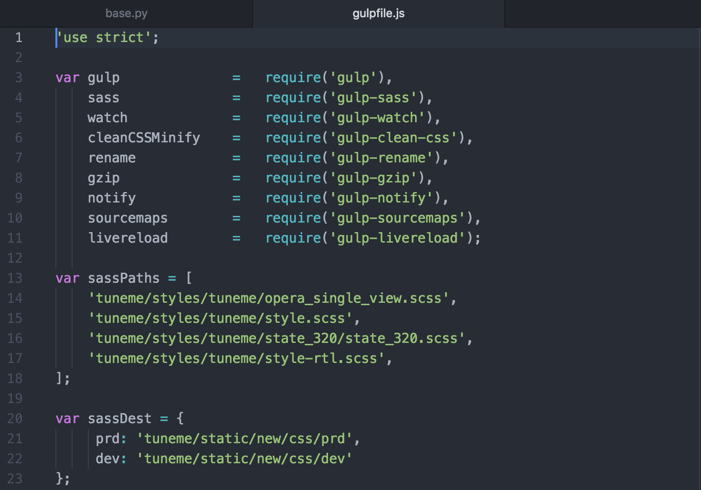

Template Patterns
=================

Praekelt Molo Design System
---------------------------

Molo design system a living document of visual design components and element markups,
which provides a set of reusable patterns that can be combined to make a cohesive website.
It documents the visual language, such as header styles and color palettes, used to create the site.
It's purpose is as a one-stop place for the entire team to reference when discussing new site designs and iterations.

The design system will make it easy to build/scaffold custom Molo mobi-sites from our Molo Framework with a
consistent look and feel using predefined Molo Core patterns and features - without reverse engineering our styles.
The Design System and Molo Core serve as a single source of truth for our Frontend Templates stack,
to help us establish cohesive user experience, a common taxonomy, enforce a modular approach and
good quality code on mobile site applications.

Mote is a container that renders pattern libraries being built by  _`Praekelt.com`: http://www.praekelt.com/

Website Components

_`Mote`: http://white-frog-248.seed.p16n.org

Website Glossary
----------------

These are the Molo sites:

* _`TuneMe`: https://tuneme.org/
* _`Springster`: http://sa.heyspringster.com/
* _`FreeBasics`: http://amabhungane.molo.site/
* _`Babycenter`: http://southafrica.babycenter.io/
* _`IoGT (Internet of Good Things)`: http://za.goodinternet.org/

Front-end Project Setup
-----------------------

Backend developers tie a collection of reusable apps with a set of guidelines - the guidelines allow developers to share, reuse, maintain and improve the source code quality which does not extend to Frontend source code resulting in unstructured, inconsistent markup with poor quality and maintainability.

MARKUP & CSS - SMACSS,BEM for single responsibility principle
~~~~~~~~~~~~~~~~~~~~~~~~~~~~~~~~~~~~~~~~~~~~~~~~~~~~~~~~~~~~~

BEM is a naming convention of markup and CSS classes sticking to single responsibility principle and organising e.g.

  .. image:: ./_static/images/bem-markup.png

SMACSS is the categorization of CSS in a logical and layered fashion broken down into 5 categories: Base, layout, module, state and theme.
Each category can either be a folder, or file which contains CSS.
We use CSS preprocessors (SASS) that removes performance penalties of using separate files by compressing and combining them into a single file.
e.g.

  .. image:: ./_static/images/smacss-setup.png

We use gulp scripts to compress and combine SASS, JS, Icon Sprites into a minified file assets.

Gulp is a Node plugin, you need to have Node.js installed on your computer https://nodejs.org/en/
All the Node.js npm packages for automation are on the application’s package.js to install run the following commands::

  npm install
  npm install --global gulp-cli npm install
  gulp

Asset processing & bundling, concatenating and minification script and package modules on project root folder::

  gulpfile.js
  package.json

Target Audience
~~~~~~~~~~~~~~~

Molo is a set of tools for publishing mobile sites primarily for feature phone and slow end device users - often e.g. slow bandwidth 2G network connections therefor speed performance is important.

Website speed performance is done using software service tool - _`Dareboost`: https://www.dareboost.com/en/home to measure speed, analyze and monitor websites.

.. _`Ways of Working`: http://ways-of-working.rtfd.org

Having a robust established ways of working we have effectively created a sustainable system that produces good quality and maintainable code
